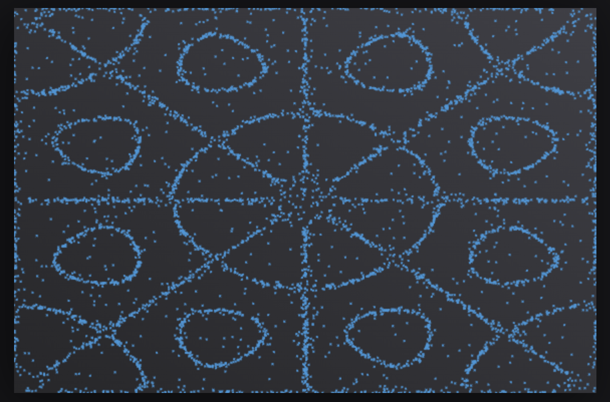

  <h1>Chladni</h1>

  

    <strong>Chladni figures simulation</strong>
  

  

## About

[Chladni figures](https://en.wikipedia.org/wiki/Ernst_Chladni#Chladni_figures) are a set of patterns discovered by Ernst Chladni when he pulled a violin bow across a metal plate covered in sand. The resonating plate vibrated more in some areas and less in others, causing the sand to bunch up in areas with lower amplitude.

I've always been fascinated by this finding as it sits at the nexus of music and physics. It also overlaps with complexity theory; The simple agentic rule "move faster if this function is high where you are" results in the emergence of higher level patterns. There's not even any interaction between sand particles, making this simulation extremely straightforward and satisfying.

  

